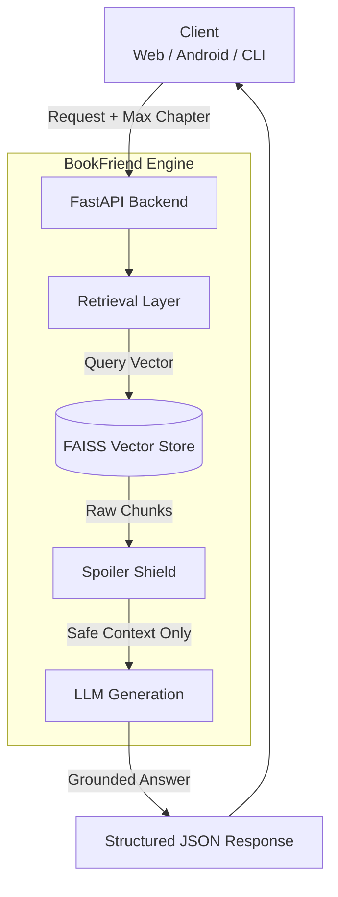

# 📘 BookFriend

**An API-first, spoiler-aware AI reading assistant backend.**


**BookFriend** is a backend service built using **Retrieval-Augmented Generation (RAG)**. It is designed to act as a grounded, context-bounded AI service rather than a generic "chat with PDF" wrapper.

It currently powers **AIRA (AI Reading Assistant)** inside the upcoming Android reading app **Quill**.

---

## 🧠 The Problem

Most AI reading tools fail in predictable ways:
* ❌ **Hallucinations:** They invent details not present in the text.
* ❌ **Spoilers:** They leak future plot points because they read the whole file at once.
* ❌ **Context Drift:** They break when user questions are ambiguous.

BookFriend is built around a different philosophy:

> **"Useful AI systems are defined by their constraints, not their capabilities."**

---

## ✨ Key Features

### 🔍 Grounded RAG Pipeline
* Semantic retrieval using **SentenceTransformers** (`all-MiniLM-L6-v2`) and **FAISS**.
* Answers are generated **only** from retrieved book context.
* Responses are traceable back to specific source chunks.

### 🛡️ Spoiler-Safe by Design
* **System-Level Enforcement:** Every request enforces a `max_chapter` constraint.
* **Pre-Generation Filtering:** Retrieval is filtered *before* the LLM ever sees the data.
* **Zero Leakage:** Impossible for the AI to "know" the ending if the reader is on Chapter 3.

### 🧭 Context-Bounded Answers
* No "global memory" or uncontrolled reasoning.
* Designed to minimize hallucinations by strictly adhering to the provided context window.

### 🔌 Headless API Architecture
* Decoupled design allows any client (Web, Android, CLI) to consume the same logic.
* Clean request/response contracts.

---

## 🏗️ Architecture

BookFriend follows a strict unidirectional data flow to ensure safety.



---

## 🧩 Core Design Principles

### 1. Stateless by Default
There is no in-memory user state. To ensure backend restarts never break correctness, every request must include:
* `user_id`
* `book_id`
* `max_chapter`

### 2. Explicit Contracts
All assumptions are made explicit at the API boundaries. There is no hidden coupling between the UI and the backend.

### 3. Rule-Based Safety > ML Safety
Spoiler prevention is enforced using deterministic logic (filtering indices), not by asking the LLM "please don't spoil this."

---

## 📦 Tech Stack

| Component | Technology |
| :--- | :--- |
| **Language** | Python 3.10+ |
| **API Framework** | FastAPI & Uvicorn |
| **Embeddings** | SentenceTransformers (`all-MiniLM-L6-v2`) |
| **Vector Store** | FAISS |
| **Persistence** | SQLite (Sessions, Metadata) |
| **Deployment** | Docker |

---

## 🔌 API Usage

### 1. Ingest a Book
Upload a text or PDF source to build the vector index.
```http
POST /v1/ingest
```

### 2. Query (RAG)
The main endpoint for asking questions. Note the `max_chapter` field.

**Request:**
```json
{
  "user_id": "user_123",
  "book_id": "the_great_gatsby",
  "query": "Why is Gatsby looking at the green light?",
  "max_chapter": 5
}
```

**Response:**
```json
{
  "answer": "Gatsby associates the green light with Daisy...",
  "sources": ["chapter_1_chunk_12", "chapter_5_chunk_3"],
  "warning": null
}
```

---

## 🧪 Engineering Decisions: Why No Fine-Tuning?

I intentionally avoided fine-tuning an LLM for this project.

1.  **Grounding:** RAG provides stronger guarantees that the answer comes from the text, not the model's training data.
2.  **Cost & Complexity:** Fine-tuning is computationally expensive and rigid.
3.  **Failure Modes:** The primary failure modes in reading assistants are system-level (spoilers), not model-level (syntax).

*This reflects a decision to prioritize engineering architecture over model optimization.*

---

## 🚀 Getting Started

### Prerequisites
* Python 3.10+
* Docker (optional)
* OpenAI API Key (or equivalent LLM provider)

### Local Setup

1. **Clone the repository**
   ```bash
   git clone [https://github.com/yourusername/BookFriend.git](https://github.com/yourusername/BookFriend.git)
   cd BookFriend
   ```

2. **Set environment variables**
   ```bash
   cp .env.example .env
   # Add your API keys to .env
   ```

3. **Run with Docker**
   ```bash
   docker-compose up --build
   ```

---

## 🔮 Roadmap

* [x] **V1:** Core RAG + Spoiler Shield
* [x] **V2:** API-first refactor & stateless design
* [ ] **V3:** Deployment, performance tuning, and caching
* [ ] **Future:** Multi-book indexing per user & smart indirect spoiler detection.

---

## 👋 Author

**[senseofomar]**

BookFriend was built as a system-focused project to explore real-world RAG constraints and safety-first GenAI architecture.
